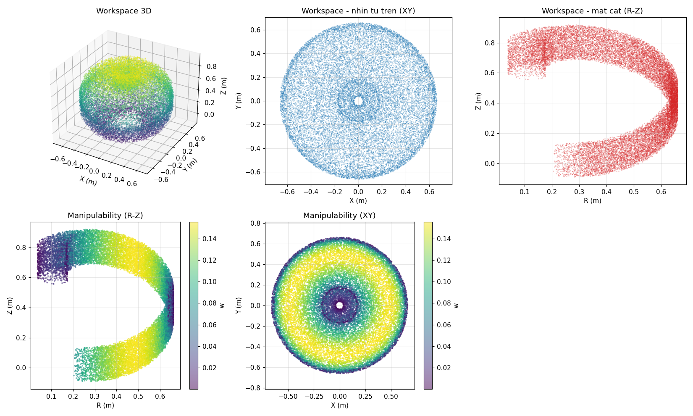

# Robot hàn 4 bậc tự do RPRR — Bài tập lớn Robotics

Thiết kế, tính toán và mô phỏng một cánh tay robot hàn 4 bậc tự do kiểu **R–P–R–R** (quay – tịnh tiến – quay – quay), làm trọn vẹn từ thiết kế cơ khí, động học, động lực học, thiết kế quỹ đạo, bộ điều khiển cho tới mô phỏng trên ROS 2.

## Nội dung

| Thư mục | Nội dung | Công cụ |
|---|---|---|
| [`01_thiet_ke_solidworks`](01_thiet_ke_solidworks) | Mô hình 3D các khâu, cụm lắp ráp, đầu hàn, bản vẽ kỹ thuật; G-code in 3D | SolidWorks, Cura |
| [`02_dong_luc_hoc_maple`](02_dong_luc_hoc_maple) | Thiết lập phương trình vi phân chuyển động của robot | Maple |
| [`03_dong_hoc_quy_dao_python`](03_dong_hoc_quy_dao_python) | Động học thuận/ngược (DH), Jacobian, không gian làm việc, chỉ số manipulability, quỹ đạo LSPB trong không gian khớp và Cartesian, animation | Python |
| [`04_bo_dieu_khien_IDPD_simulink`](04_bo_dieu_khien_IDPD_simulink) | Bộ điều khiển IDPD (Inverse Dynamics PD) bám quỹ đạo | MATLAB / Simulink |
| [`05_mo_phong_ros2`](05_mo_phong_ros2) | Mô hình URDF, mô phỏng Gazebo + RViz, điều khiển vị trí từng khớp bằng PID của Gazebo | ROS 2 Jazzy, Gazebo Harmonic |

## Thông số robot (DH)

| Khớp | Loại | d (m) | a (m) | α (°) | Giới hạn |
|---|---|---|---|---|---|
| q1 | Quay | 0.2175 | 0 | 0 | 0° → 360° |
| q2 | Tịnh tiến | q2 | 0.25 | 90 | 0 → 0.225 m |
| q3 | Quay (θ = q3 + 90°) | 0.105 | 0 | 90 | −90° → 135° |
| q4 | Quay (mỏ hàn) | 0.262 | 0 | 0 | 0° → 360° |

Đế cố định d0 = 0.084 m. Đầu mỏ hàn lệch (−68, 0, 126) mm so với hệ O4.

Quy ước điểm cuối: không gian làm việc (`main.py`) tính cho **đầu mỏ hàn** (có offset trên); còn quỹ đạo hàn, động học ngược, Simulink và mô phỏng ROS 2 đều tính cho **gốc hệ O4** (q4 = 0).

**Động học thuận** (gốc hệ O4):

```
x = 0.25·cos q1 + 0.105·sin q1 + 0.262·cos q1·cos q3
y = 0.25·sin q1 − 0.105·cos q1 + 0.262·sin q1·cos q3
z = q2 + 0.262·sin q3 + 0.3015
```

**Động học ngược**:

```
q1 = atan2(0.105, √(x² + y² − 0.105²)) + atan2(y, x)
q3 = atan2(√(1 − D²), D),   D = (x·cos q1 + y·sin q1 − 0.25) / 0.262
q2 = z − 0.262·sin q3 − 0.3015
```

Mô hình này thống nhất trong toàn bộ repo: bảng DH (`config/dh_params.yaml`), URDF trong ROS 2, các script quỹ đạo Python và node điều khiển Gazebo.

## Chu trình hàn

Hàn hồ quang không tiếp xúc trên đoạn thẳng đứng BA dài 0.2 m. Quỹ đạo Cartesian dùng biên dạng vận tốc hình thang (LSPB), chu kỳ lấy mẫu 0.01 s.

| Điểm | Tọa độ (m) | Biến khớp (q1 rad, q2 m, q3 rad) |
|---|---|---|
| HOME | (0.1518, −0.2730, 0.7698) | (−0.7205, 0.2101, 1.4013) |
| B — bắt đầu hàn | (0.1589, −0.1543, 0.7782) | (−0.2768, 0.2205, 1.7822) |
| A — kết thúc hàn | (0.1589, −0.1543, 0.5782) | (−0.2768, 0.0205, 1.7822) |

| Giai đoạn | Vận tốc max | Gia tốc | Thời điểm kết thúc |
|---|---|---|---|
| HOME → B | 0.05 m/s | 0.10 m/s² | 2.88 s |
| Dừng tại B (mồi hồ quang) | — | — | 3.38 s |
| B → A (hàn) | 0.01 m/s | 0.05 m/s² | 23.58 s |
| Dừng tại A (điền đầy miệng hàn) | — | — | 24.58 s |
| A → HOME | 0.05 m/s | 0.10 m/s² | 29.60 s |

Tổng cộng 2961 điểm tham chiếu (`Cartesian_Waypoints.txt`). Quỹ đạo khớp tương ứng được xuất sang Simulink (`Vitridat.mat`, `Vantocdat.mat`, `Giatocdat.mat`).

## Hướng dẫn chạy nhanh

**Động học & quỹ đạo (Python)**

```bash
cd 03_dong_hoc_quy_dao_python
pip install -r requirements.txt
python main.py            # không gian làm việc + manipulability -> data/ket_qua.png
python JointSpace.py      # quỹ đạo khớp + xuất Vitridat/Vantocdat/Giatocdat.mat cho Simulink
python CartesianSpace.py  # quỹ đạo Cartesian + xuất Cartesian_Waypoints.txt
python animation.py       # animation 3D robot chạy theo quỹ đạo
python -m src.run_simulation  # kiểm tra nhanh Jacobian tại một cấu hình mẫu
```

**Bộ điều khiển IDPD (MATLAB)**: chạy `initialize.m` trước để nạp tham số, sau đó mở `controller_simulation.slx` và bấm Run. Xem [README](04_bo_dieu_khien_IDPD_simulink/README.md).

**Mô phỏng ROS 2**: xem [05_mo_phong_ros2/README.md](05_mo_phong_ros2/README.md).

## Giấy phép

[MIT](LICENSE)

## Kết quả


